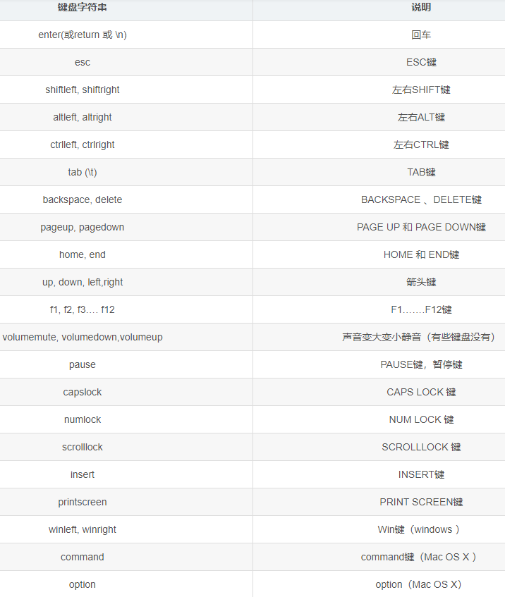

# PyAutoGUI模块学习笔记

**实现鼠键程序化控制**

## 模块PyautoGUI

使用python中的pyautogui模块

## 常用属性方法

### 运行退出

***此属性极为重要，能防止程序接管键盘鼠标之后程序无法关闭的问题***

```python
pyautogui.FAILSAFE = False
```

### 屏幕分辨率

```python
# 返回两个参数，分别是屏幕宽度width和高度height
pyautogui.size()
```

### 鼠标操作

#### 鼠标移动

##### 移动到指定坐标

```python
# 前两个参数是目的点在屏幕中的二维坐标，第三个参数是移动的动作进行的时间，单位是秒，可选
pyautogui.moveTo(100, 200, duration = 1)
```

##### 按自身参考系移动

```python
# 从当前位置按规定的像素值进行移动，第一个参数是左右移动的像素值，第二个参数是上下移动的像素值，第三个是动作时间，可选
pyautogui.moveRel(100, 200, duration = 1)
```

#### 鼠标当前位置

```python
# 两个参数，分别为在屏幕上的x，y坐标
pyautogui.position()
```

#### 鼠标点击

##### 鼠标单击

```python
# 鼠标左键单击指定绝对坐标
pyautogui.click(100, 100)
pyautogui.click(100, 100, button='left')
# 鼠标右键单击指定绝对坐标
pyautogui.click(100, 100, button='right')
# 鼠标滚轮单击指定绝对坐标
pyautogui.click(100, 100, button='middle')
```

##### 鼠标双击

```python
# 左键双击指定绝对坐标
pyautogui.doubleClick(100, 100)
# 右键双击指定绝对坐标
pyautogui.rightClick(100, 100)
# 滚轮双击指定绝对坐标
pyautogui.middleClick(100, 100)
```

##### 鼠标按下与松开

```python
# 按下
pyautogui.mouseDown()
# 松开
pyautogui.mouseUp()
```

##### 鼠标拖动

```python
# 鼠标拖动到指定绝对坐标
pyautogui.dragTo(100, 100, duration = 1)
# 以自身参考系将鼠标拖动，前两个参数分别为左右、上下移动像素
pyautogui.dragRel(100, 100, duration = 1) 
```

##### 鼠标滚动

```python
# 参数是个整数，参数为正时向上滚，单位根据操作系统而定
pyautogui.scroll(300)
```

### 屏幕处理

#### 获取屏幕截图

```python
# 返回的im是屏幕截图的一个对象，可对此对象进行相关操作
im = pyautogui.screenshot()
```

#### 将截图保存为文件

```python
im = pyautogui.screenshot()
# 将图片对象保存为图片文件
im.save('screenshot.png')
```

#### 获取指定点的颜色

```python
im = pyautogui.screenshot()
# 返回im对象上坐标为(100, 100)这一像素的颜色，是一个RGB元组
im.getpixel((100, 100))
```

#### 指定点的颜色与指定的颜色对比

```python
im = pyautogui.screenshot()
# 将100，100坐标的颜色与第三个参数规定的RGB颜色对比看是否相同
pyautogui.pixelMatchesColor(100, 100, (0, 0, 0))
```

#### 图片匹配

```python
# 用参数指定的图片对当前屏幕进行匹配（匹配一个元素），匹配成功返回匹配的图片在屏幕中的位置，否则返回None
image1 = pyautogui.locateOnScreen('img.png')
# 匹配多个,匹配成功返回一个list，包含所有匹配成功的图片的位置
image2 = pyautogui.locateAllOnScreen('img.png')
# 得到指定位置的中心坐标
pyautogui.center(image1)
```

### 键盘操作

#### 一般键输入

```python
# 模拟按键按下，不松
pyautogui.keyDown('a')
# 模拟按键释放
pyautogui.keyUp('a')
# 按下然后立即松开
pyautogui.press('a')
# 第一参数是输入内容，第二个参数是输入时每个字符的间隔时间
pyautogui.typewrite('hello',0.5)
# 参数也可以是单字母的列表
pyautogui.typewrite(['T','h','i','s'])
```

* keyDown()和keyUp()配合使用可以实现快捷键（同时按多个按键）的功能

* 快捷键也可以以下面的方式实现

  ```python
  pyautogui.hotkey('ctrl', 'c')
  ```

  

#### 特殊功能按键输入



例：

```python
pyautogui.typewrite('d', 'g', 'left', 'o')
# 输出的结果为dog，并且结束的时候光标定在o的后面
```

### GUI控件的使用

#### 警示弹窗

```python
pyautogui.alert(text = 'This is an alert box', title='alert')
# 点击确认按钮后返回字符串"OK"
```

#### 选择弹窗

```python
pyautogui.confirm('options', button = ['A', 'B', 'C'])
# 返回点击的选项，字符串形式
```

#### 密码输入弹窗

```python
pyautogui.password('password')
# 输入密码会隐藏，确认后返回值为刚才的输入内容
```

 #### 一般输入弹窗

```python
pyautogui.prompt('input')
# 确认后返回刚才的输入
```

